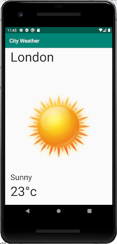
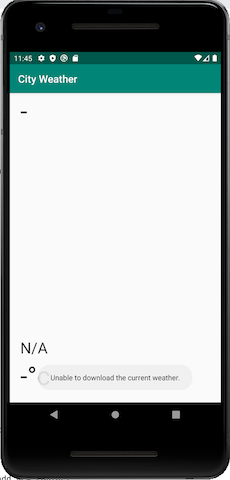

# City-Weather
Simple demo application that showcases synchronising weather information from server using best practices

# App Screenshot

<table>
  <tr>
      <td>City Weather View Success</td>
      <td>City Weather View Failure</td>
  </tr>
  <tr>
    <td></td>
    <td></td>
  </tr>
 </table>
 
 # Project Structure
